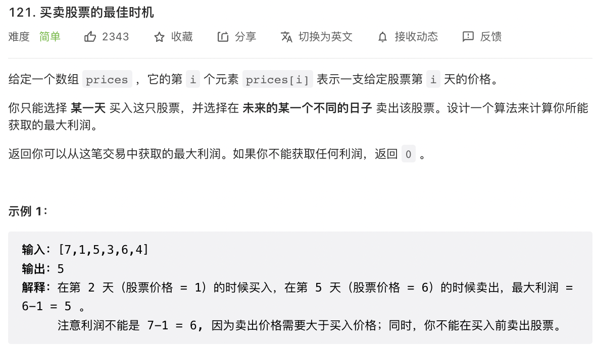

# leetcode（118-146）

## 118. 杨辉三角

```
/**
 * @param {number} numRows
 * @return {number[][]}
 */
const generate = (numRows) => {
    const ret = [];

    for (let i = 0; i < numRows; i++) {
        const row = new Array(i + 1).fill(1);
        for (let j = 1; j < row.length - 1; j++) {
            row[j] = ret[i - 1][j - 1] + ret[i - 1][j];
        }
        ret.push(row);
    }
    return ret;
};
```

## 121. 买卖股票的最佳时机

```
/**
 * @param {number[]} prices
 * @return {number}
 */
//时间复杂度O(n) 空间复杂度O(n)，dp数组第二维是常数
const maxProfit = function (prices) {
    let n = prices.length;
    let dp = Array.from(new Array(n), () => new Array(2));
    dp[0][0] = 0; //第0天不持有
    dp[0][1] = -prices[0]; //第0天持有
    for (let i = 1; i < n; i++) {
        dp[i][0] = Math.max(dp[i - 1][0], dp[i - 1][1] + prices[i]);
        dp[i][1] = Math.max(dp[i - 1][1], -prices[i]);
    }
    return dp[n - 1][0];
};
```


## 122. 买卖股票的最佳时机 II

```
const maxProfit = (prices) => {
    const n = prices.length;
    const dp = new Array(n).fill(0).map(v => new Array(2).fill(0));
    dp[0][0] = 0, dp[0][1] = -prices[0];
    for (let i = 1; i < n; ++i) {
        dp[i][0] = Math.max(dp[i - 1][0], dp[i - 1][1] + prices[i]);
        dp[i][1] = Math.max(dp[i - 1][1], dp[i - 1][0] - prices[i]);
    }
    return dp[n - 1][0];
};
```

## 123. 买卖股票的最佳时机 III

```
/**
 * @param {number[]} prices
 * @return {number}
 */
const maxProfit = (prices) => {
    const n = prices.length;
    let buy1 = -prices[0], buy2 = -prices[0];
    let sell1 = 0, sell2 = 0;
    for (let i = 1; i < n; i++) {
        buy1 = Math.max(buy1, -prices[i]);
        sell1 = Math.max(sell1, buy1 + prices[i]);
        buy2 = Math.max(buy2, sell1 - prices[i]);
        sell2 = Math.max(sell2, buy2 + prices[i]);
    }
    return sell2;
};
```


## 125. 验证回文串

```
/**
 * @param {string} s
 * @return {boolean}
 */
const isPalindrome = (s) => {
    s = s.replace(/[\W|_]/g, "").toLowerCase();
    if (s.length < 2) {
        return true;
    }
    let left = 0;
    let right = s.length - 1;
    while (left < right) {
        if (s[left] !== s[right]) {//对撞指针判断左右两边是否是相同的字符
            return false;
        }
        left++;
        right--;
    }
    return true;
};
```

## 128. 最长连续序列

```
/**
 * @param {number[]} nums
 * @return {number}
 */
const longestConsecutive = (nums) => {
    // 把题目中数组的数字全部放入set中，一来去重，二来方便快速查找
    const set = new Set(nums);
    let max = 0;
    for (let [key, a] of set.entries()) {
        // 没有左邻居，是序列的起点
        if (!set.has(a - 1)) {
            let count = 1;
            let cur = a;
            // 有右邻居，看连续的右邻居有多少个
            while (set.has(cur + 1)) {
                cur++;
                count++;
            }
            // 存放最大的连续邻居的值
            max = Math.max(max, count);
        }
    }
    return max;
};
```

## 136. 只出现一次的数字

```
/**
 * @param {number[]} nums
 * @return {number}
 */
const singleNumber = (nums) => {
    let ans = 0;
    for (const num of nums) {
        ans ^= num;
    }
    return ans;
};
```

## 144. 二叉树的前序遍历

```
/**
 * @param {TreeNode} root
 * @return {number[]}
 */
const preorderTraversal = (root, res = []) => {
    if (!root) return res;
    res.push(root.val);
    preorderTraversal(root.left, res)
    preorderTraversal(root.right, res)
    return res;
};
```


## 145. 二叉树的后序遍历

```
/**
 * @param {TreeNode} root
 * @return {number[]}
 */
const postorderTraversal =  (root, res = []) =>{
    if (!root) return res;
    postorderTraversal(root.left, res);
    postorderTraversal(root.right, res);
    res.push(root.val);
    return res;
};
```

## 146. LRU 缓存

```
/**
 * @param {number} capacity
 */
var LRUCache = function(capacity) {
    this.map = new Map();
    this.capacity = capacity;
};

/** 
 * @param {number} key
 * @return {number}
 */
LRUCache.prototype.get = function(key) {
    if(this.map.has(key)){
        let value = this.map.get(key);
        this.map.delete(key); // 删除后，再 set ，相当于更新到 map 最后一位
        this.map.set(key, value);
        return value
    } else {
        return -1
    }
};

/** 
 * @param {number} key 
 * @param {number} value
 * @return {void}
 */
LRUCache.prototype.put = function(key, value) {
    // 如果已有，那就要更新，即要先删了再进行后面的 set
    if(this.map.has(key)){
        this.map.delete(key);
    }
    this.map.set(key, value);
    // put 后判断是否超载
    if(this.map.size > this.capacity){
        this.map.delete(this.map.keys().next().value);
    }

};

/**
 * Your LRUCache object will be instantiated and called as such:
 * var obj = new LRUCache(capacity)
 * var param_1 = obj.get(key)
 * obj.put(key,value)
 */

```

