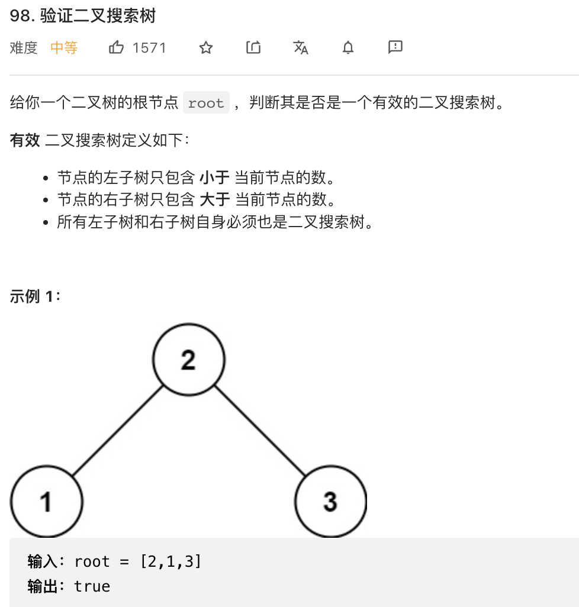
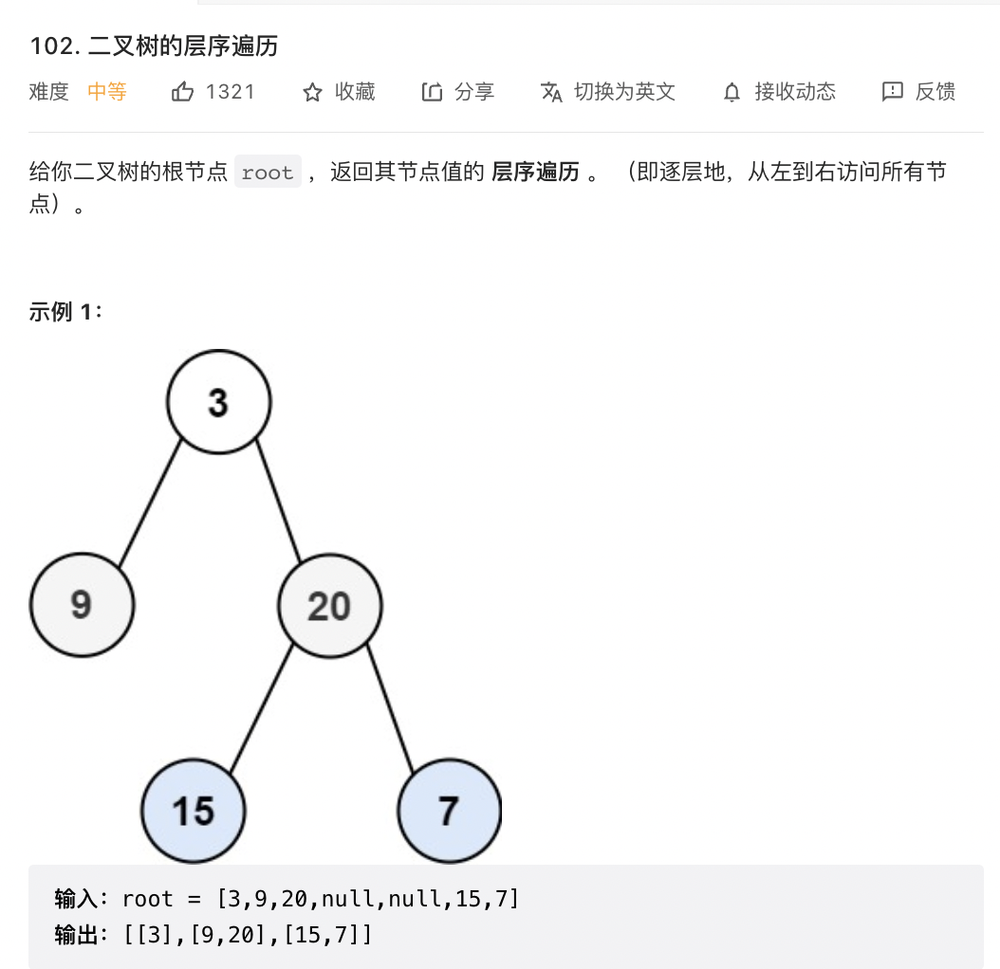

# leetcode（77-110）

## 77. 组合

```
/**
 * @param {number} n
 * @param {number} k
 * @return {number[][]}
 */
const combine = (n, k) => {
    const ans = [];
    const dfs = (cur, n, k, temp) => {
        // 剪枝：temp 长度加上区间 [cur, n] 的长度小于 k，不可能构造出长度为 k 的 temp
        if (temp.length + (n - cur + 1) < k) {
            return;
        }
        // 记录合法的答案
        if (temp.length == k) {
            ans.push(temp);
            return;
        }
        // 考虑选择当前位置
        dfs(cur + 1, n, k, [...temp, cur]);
        // 考虑不选择当前位置
        dfs(cur + 1, n, k, temp);
    }
    dfs(1, n, k, []);
    return ans;
};
```

## 78. 子集

```
/**
 * @param {number[]} nums
 * @return {number[][]}
 */
const subsets = (nums) => {
    const t = [];
    const ans = [];
    const n = nums.length;
    const dfs = (cur) => {
        if (cur === nums.length) {
            ans.push(t.slice());
            return;
        }
        t.push(nums[cur]);
        dfs(cur + 1, nums);
        t.pop(t.length - 1);
        dfs(cur + 1, nums);
    }
    dfs(0, nums);
    return ans;
};
```

## 88. 合并两个有序数组

```
/**
 * @param {number[]} nums1
 * @param {number} m
 * @param {number[]} nums2
 * @param {number} n
 * @return {void} Do not return anything, modify nums1 in-place instead.
 */
const merge = (nums1, m, nums2, n) => {
    nums1.splice(m, nums1.length - m, ...nums2);
    nums1.sort((a, b) => a - b);
};
```

## 93. 复原 IP 地址

```
/**
 * @param {string} s
 * @return {string[]}
 */
const restoreIpAddresses = (s) => {
    const SEG_COUNT = 4;
    const segments = new Array(SEG_COUNT);
    const ans = [];

    const dfs = (s, segId, segStart) => {
        // 如果找到了 4 段 IP 地址并且遍历完了字符串，那么就是一种答案
        if (segId === SEG_COUNT) {
            if (segStart === s.length) {
                ans.push(segments.join('.'));
            }
            return;
        }

        // 如果还没有找到 4 段 IP 地址就已经遍历完了字符串，那么提前回溯
        if (segStart === s.length) {
            return;
        }

        // 由于不能有前导零，如果当前数字为 0，那么这一段 IP 地址只能为 0
        if (s.charAt(segStart) === '0') {
            segments[segId] = 0;
            dfs(s, segId + 1, segStart + 1);
        }

        // 一般情况，枚举每一种可能性并递归
        let addr = 0;
        for (let segEnd = segStart; segEnd < s.length; ++segEnd) {
            addr = addr * 10 + (s.charAt(segEnd) - '0');
            if (addr > 0 && addr <= 0xFF) {
                segments[segId] = addr;
                dfs(s, segId + 1, segEnd + 1);
            } else {
                break;
            }
        }
    }

    dfs(s, 0, 0);
    return ans;
};
```


## 94. 二叉树的中序遍历

```
/**
 * @param {TreeNode} root
 * @return {number[]}
 */
const inorderTraversal = (root) => {
    const res = [];
    const inorder = (root) => {
        if (!root) {
            return;
        }
        inorder(root.left);
        res.push(root.val);
        inorder(root.right);
    }
    inorder(root);
    return res;
};
```


## 98. 验证二叉搜索树

```
/**
 * @param {TreeNode} root
 * @return {boolean}
 */
const helper = (root, lower, upper) => {
    if (root === null) {
        return true;
    }
    if (root.val <= lower || root.val >= upper) {
        return false;
    }
    return helper(root.left, lower, root.val) && helper(root.right, root.val, upper);
}
const isValidBST = (root) => {
    return helper(root, -Infinity, Infinity);
};
```

## 101. 对称二叉树

```
/**
 * @param {TreeNode} root
 * @return {boolean}
 */
const isSymmetric = (root) => {
    //使用递归遍历左右子树 递归三部曲
    // 1. 确定递归的参数 root.left root.right和返回值true false 
    const compareNode = function (left, right) {
        //2. 确定终止条件 空的情况
        if (left === null && right !== null || left !== null && right === null) {
            return false;
        } else if (left === null && right === null) {
            return true;
        } else if (left.val !== right.val) {
            return false;
        }
        //3. 确定单层递归逻辑
        let outSide = compareNode(left.left, right.right);
        let inSide = compareNode(left.right, right.left);
        return outSide && inSide;
    }
    if (root === null) {
        return true;
    }
    return compareNode(root.left, root.right);
};
```

## 102. 二叉树的层序遍历

```
/**
 * @param {TreeNode} root
 * @return {number[][]}
 */
const levelOrder = (root) => {
    const ret = [];
    if (!root) {
        return ret;
    }

    const q = [];
    q.push(root);
    while (q.length !== 0) {
        const currentLevelSize = q.length;
        ret.push([]);
        for (let i = 1; i <= currentLevelSize; ++i) {
            const node = q.shift();
            ret[ret.length - 1].push(node.val);
            if (node.left) q.push(node.left);
            if (node.right) q.push(node.right);
        }
    }

    return ret;
};
```

## 104. 二叉树的最大深度

```
/**
 * @param {TreeNode} root
 * @return {number}
 */
const maxDepth = (root) => {
    if (!root) {
        return 0;
    } else {
        const left = maxDepth(root.left);
        const right = maxDepth(root.right);
        return Math.max(left, right) + 1;
    }
};
```

## 110. 平衡二叉树

```
/**
 * @param {TreeNode} root
 * @return {boolean}
 */
const isBalanced = (root) => {
    //还是用递归三部曲  + 后序遍历 左右中 当前左子树右子树高度相差大于1就返回-1
    // 1. 确定递归函数参数以及返回值
    const getDepth = function (node) {
        // 2. 确定递归函数终止条件
        if (node === null) {
            return 0;
        }
        // 3. 确定单层递归逻辑
        let leftDepth = getDepth(node.left);//左子树高度
        if (leftDepth === -1) {
            return -1;
        }
        let rightDepth = getDepth(node.right);//右子树高度
        if (rightDepth === -1) {
            return -1;
        }
        if (Math.abs(leftDepth - rightDepth) > 1) {
            return -1;
        } else {
            return 1 + Math.max(leftDepth, rightDepth);
        }
    }
    return getDepth(root) === -1 ? false : true;
};
```