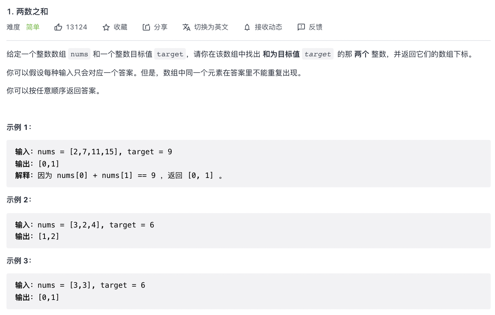
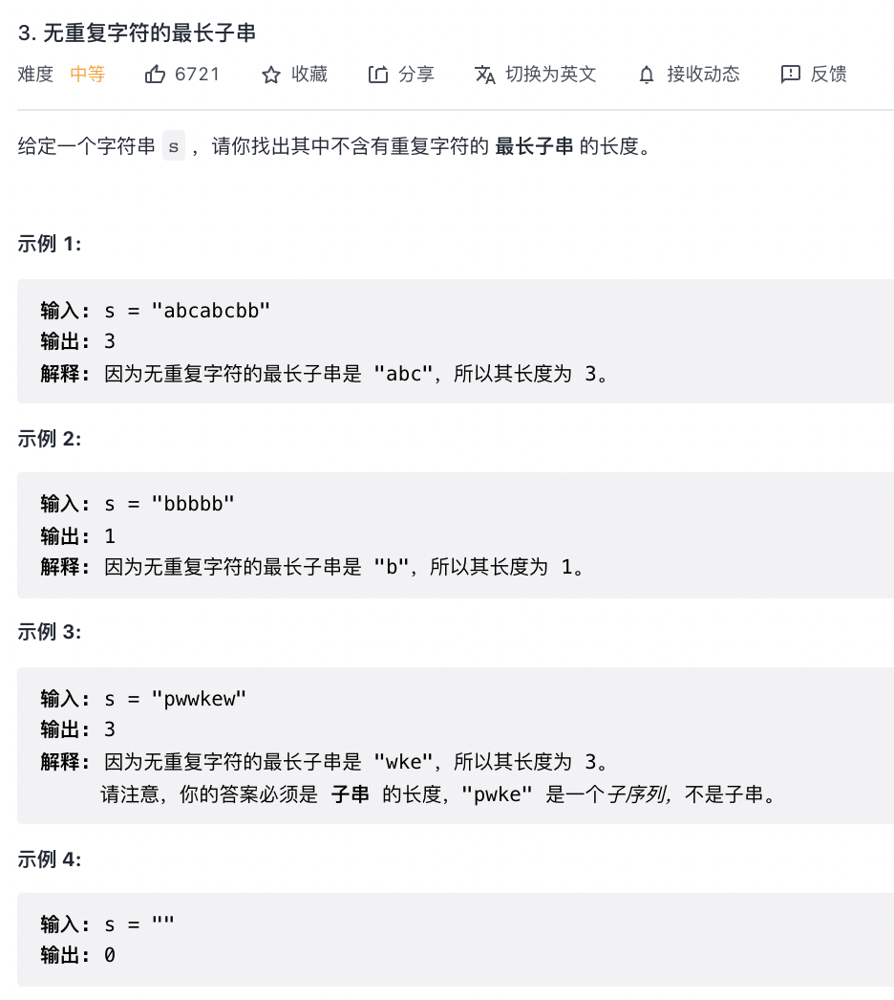
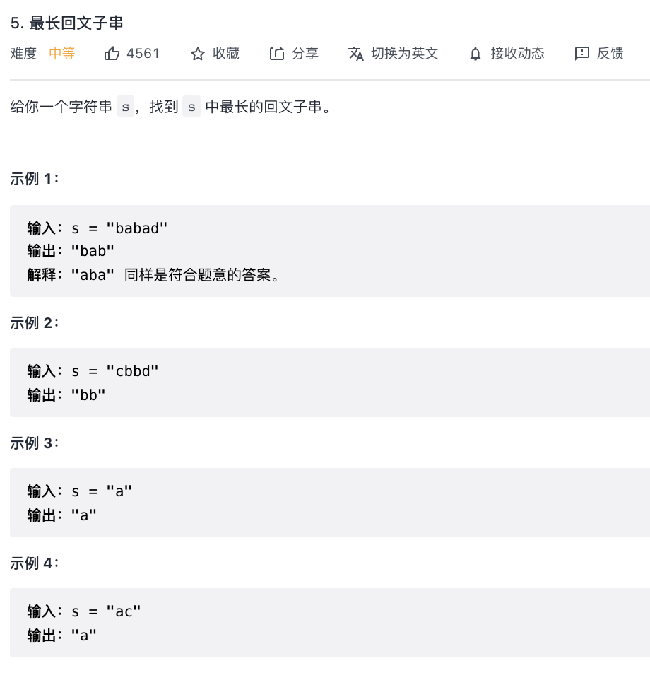
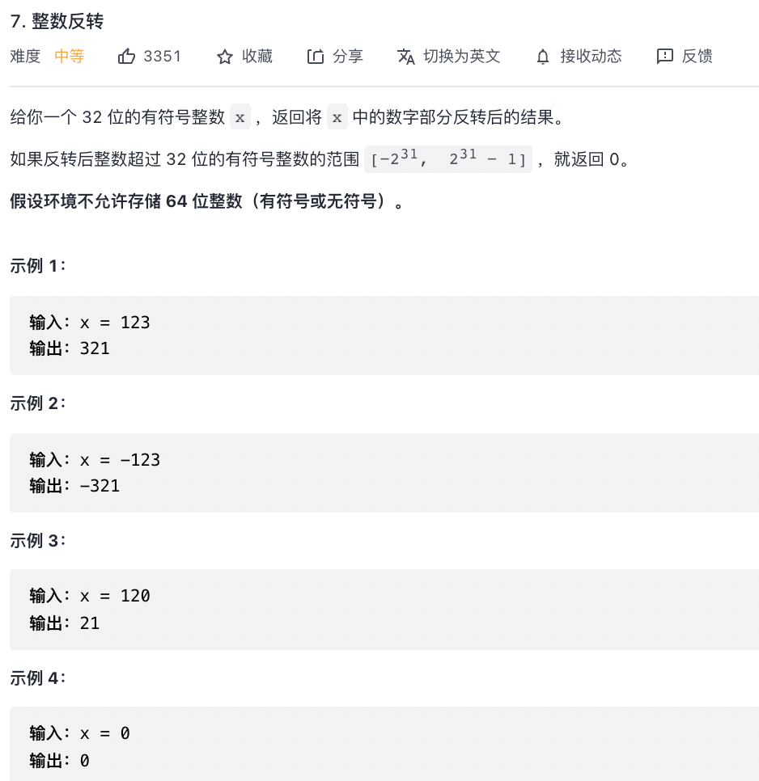

# leetcode（1/3/4/5/6/7/8/9/10）

## 1. 两数之和

```
/**
 * 两数之和算法
 * @param {array} array 
 * @param {number} target 
 */
const twoSum = (array, target) => {
    let map = new Map()
    for (let index = 0; index < array.length; index++) {
        let num = target - array[index]
        if (map.has(num)) {
            return [map.get(num), index]
        } else {
            map.set(array[index], index)
        }
    }
}
```

## 3. 无重复字符的最长子串

```
/**
 * 无重复字符的最长子串
 * @param {string} s
 */
const lengthOfLongestSubstring = (s) => {
    let arr = [];
    let max = 0;
    for (let i = 0; i < s.length; i++) {
        let index = arr.indexOf(s[i]);
        if (index !== -1) {
            arr.splice(0, index + 1);
        }
        arr.push(s.charAt(i));
        max = Math.max(arr.length, max)
    }
    return max;
}
```

## 5. 最长回文子串

```

```

## 7. 整数反转

```
/**
 * 7. 整数反转
 * @param {number} x
 * @return {number}
 */
const intReverse = (x) => {
    let result = 0;
    while (x !== 0) {
        result = result * 10 + x % 10;
        x = (x / 10) | 0;
    }
    return (result | 0) === result ? result : 0;
};
```