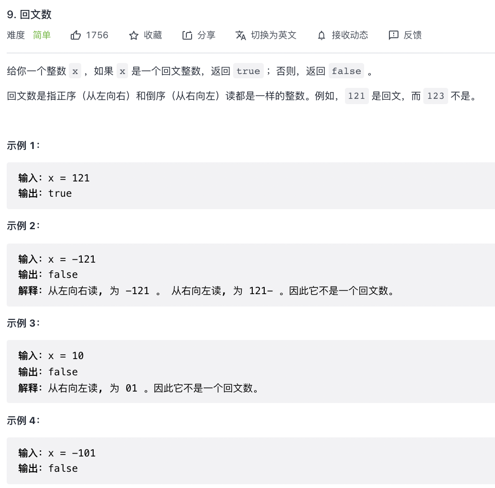

# leetcode（1/3/5/7/9/12/17/20/26/27）

## 1. 两数之和

```
/**
 * 两数之和算法
 * @param {array} array 
 * @param {number} target 
 */
const twoSum = (array, target) => {
    let map = new Map()
    for (let index = 0; index < array.length; index++) {
        let num = target - array[index]
        if (map.has(num)) {
            return [map.get(num), index]
        } else {
            map.set(array[index], index)
        }
    }
}
```

## 3. 无重复字符的最长子串

```
/**
 * 无重复字符的最长子串
 * @param {string} s
 */
const lengthOfLongestSubstring = (s) => {
    let arr = [];
    let max = 0;
    for (let i = 0; i < s.length; i++) {
        let index = arr.indexOf(s[i]);
        if (index !== -1) {
            arr.splice(0, index + 1);
        }
        arr.push(s.charAt(i));
        max = Math.max(arr.length, max)
    }
    return max;
}
```

## 5. 最长回文子串

```
/**
 * 5. 最长回文子串
 * @param {string} s
 * @return {string}
 */
const longestPalindrome = (s) => {
    if (s.length < 2) {
        return s
    }
    let res = ''
    for (let i = 0; i < s.length; i++) {
        // 回文子串长度是奇数
        helper(i, i)
        // 回文子串长度是偶数
        helper(i, i + 1)
    }
    function helper(m, n) {
        while (m >= 0 && n < s.length && s[m] == s[n]) {
            m--
            n++
        }
        // 注意此处m,n的值循环完后  是恰好不满足循环条件的时刻
        // 此时m到n的距离为n-m+1，但是mn两个边界不能取 所以应该取m+1到n-1的区间  长度是n-m-1
        if (n - m - 1 > res.length) {
            // slice也要取[m+1,n-1]这个区间 
            res = s.slice(m + 1, n)
        }
    }
    return res
};
```

## 7. 整数反转

```
/**
 * 7. 整数反转
 * @param {number} x
 * @return {number}
 */
const intReverse = (x) => {
    let result = 0;
    while (x !== 0) {
        result = result * 10 + x % 10;
        x = (x / 10) | 0;
    }
    return (result | 0) === result ? result : 0;
};
```


## 9. 回文数

```
/**
 * 9. 回文数
 * @param {number} x
 * @return {number}
 */
const isPalindrome = (x) => {
    return x.toString() == x.toString().split('').reverse().join('')
};
```

## 12. 整数转罗马数字


```
/**
 * 12. 整数转罗马数字
 * @param {number} num
 * @return {string}
 */
const intToRoman = (num) => {
    const valueSymbols = [[1000, "M"], [900, "CM"], [500, "D"], [400, "CD"], [100, "C"], [90, "XC"], [50, "L"], [40, "XL"], [10, "X"], [9, "IX"], [5, "V"], [4, "IV"], [1, "I"]];
    const roman = [];
    for (const [value, symbol] of valueSymbols) {
        while (num >= value) {
            num -= value;
            roman.push(symbol);
        }
        if (num == 0) {
            break;
        }
    }
    return roman.join('');
};
```

## 17. 电话号码的字母组合

```
/**
 * 17. 电话号码的字母组合
 * @param {string} numStr
 * @return {string[]}
 */
 const letterCombinations = (numStr) => {
    // 建立电话号码键盘映射
    const map = ['', 1, 'abc', 'def', 'ghi', 'jkl', 'mno', 'pqrs', 'tuv', 'wxyz'];
    // 把输入字符串按单字符分隔变成数组，234=>[2,3,4]
    let numArr = numStr.split('');
    // 保存键盘映射后的字母内容，如 23=>['abc','def']
    let keyArr = numArr.map(ele => {
        return map[ele]
    });
    if (numStr.length === 0) {
        return keyArr;
    }
    if (numStr.length === 1) {
        return keyArr.join().split('');
    }
    const combinationsHandler = (arr) => {
        // 临时变量用来保存前两个组合的结果
        let temp = [];
        // 最外层的循环是遍历第一个元素，里层的循环是遍历第二个元素
        for (let i = 0, iLength = arr[0].length; i < iLength; i++) {
            for (let j = 0, jLength = arr[1].length; j < jLength; j++) {
                temp.push(`${arr[0][i]}${arr[1][j]}`)
            }
        }
        arr.splice(0, 2, temp)
        return arr.length > 1 ? combinationsHandler(arr) : temp;
    }
    return combinationsHandler(keyArr)
}
```

## 20. 有效的括号

```
/**
 * 20. 有效的括号
 * @param {string} s
 * @return {boolean}
 */
const isValid = (s) => {
    const n = s.length;
    if (n % 2 === 1) {
        return false;
    }
    const pairs = new Map([
        [')', '('],
        [']', '['],
        ['}', '{']
    ]);
    const stk = [];
    for (let ch of s) {
        if (pairs.has(ch)) {
            if (!stk.length || stk[stk.length - 1] !== pairs.get(ch)) {
                return false;
            }
            stk.pop();
        }
        else {
            stk.push(ch);
        }
    };
    return !stk.length;
};
```

## 26. 删除有序数组中的重复项

```
/**
 * 26. 删除有序数组中的重复项
 * @param {number[]} nums
 * @return {number}
 */
const removeDuplicates = (nums) => {
    const n = nums.length;
    if (n === 0) {
        return 0;
    }
    let fast = 1, slow = 1;
    while (fast < n) {
        if (nums[fast] !== nums[fast - 1]) {
            nums[slow] = nums[fast];
            ++slow;
        }
        ++fast;
    }
    return slow;
};
```

## 27. 移除元素

```
/**
 * 27. 移除元素
 * @param {number[]} nums
 * @param {number} val
 * @return {number}
 */
const removeElement = (nums, val) => {
    const n = nums.length;
    let left = 0;
    for (let right = 0; right < n; right++) {
        if (nums[right] !== val) {
            nums[left] = nums[right];
            left++;
        }
    }
    return left;
};
```