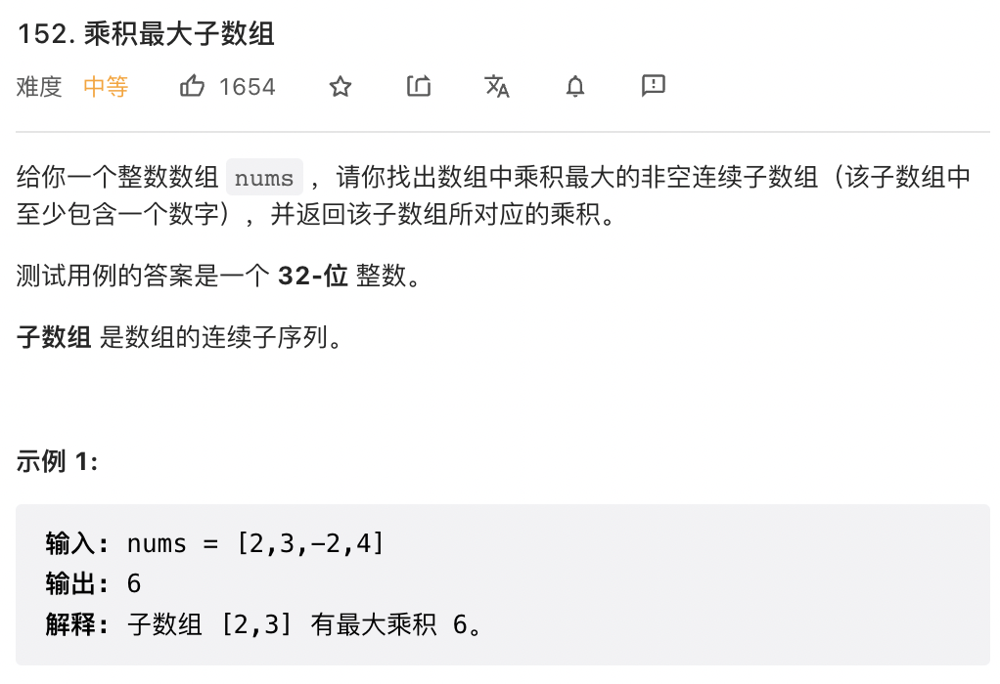

# leetcode（）

## 148. 排序链表

```
/**
 * @param {ListNode} head
 * @return {ListNode}
 */
const merge = (head1, head2) => {
    const dummyHead = new ListNode(0);
    let temp = dummyHead, temp1 = head1, temp2 = head2;
    while (temp1 !== null && temp2 !== null) {
        if (temp1.val <= temp2.val) {
            temp.next = temp1;
            temp1 = temp1.next;
        } else {
            temp.next = temp2;
            temp2 = temp2.next;
        }
        temp = temp.next;
    }
    if (temp1 !== null) {
        temp.next = temp1;
    } else if (temp2 !== null) {
        temp.next = temp2;
    }
    return dummyHead.next;
}

const toSortList = (head, tail) => {
    if (head === null) {
        return head;
    }
    if (head.next === tail) {
        head.next = null;
        return head;
    }
    let slow = head, fast = head;
    while (fast !== tail) {
        slow = slow.next;
        fast = fast.next;
        if (fast !== tail) {
            fast = fast.next;
        }
    }
    const mid = slow;
    return merge(toSortList(head, mid), toSortList(mid, tail));
}

const sortList = (head) => {
    return toSortList(head, null);
};
```

## 151. 颠倒字符串中的单词

```
/**
 * @param {string} s
 * @return {string}
 */
const reverseWords = (s) => {
    return s.trim().split(/\s+/).reverse().join(' ');
};
```

## 152. 乘积最大子数组

```
/**
 * @param {number[]} nums
 * @return {number}
 */
 const maxProduct = (nums) => {
    let res = nums[0]
    let prevMin = nums[0]
    let prevMax = nums[0]
    let temp1 = 0, temp2 = 0
    for (let i = 1; i < nums.length; i++) {
        temp1 = prevMin * nums[i]
        temp2 = prevMax * nums[i]
        prevMin = Math.min(temp1, temp2, nums[i])
        prevMax = Math.max(temp1, temp2, nums[i])
        res = Math.max(prevMax, res)
    }
    return res
}
```

## 164. 最大间距

```
/**
 * @param {number[]} nums
 * @return {number}
 */
const maximumGap = (nums) => {
    const n = nums.length;
    if (n < 2) {
        return 0;
    }
    let exp = 1;
    const buf = new Array(n).fill(0);
    const maxVal = Math.max(...nums);

    while (maxVal >= exp) {
        const cnt = new Array(10).fill(0);
        for (let i = 0; i < n; i++) {
            let digit = Math.floor(nums[i] / exp) % 10;
            cnt[digit]++;
        }
        for (let i = 1; i < 10; i++) {
            cnt[i] += cnt[i - 1];
        }
        for (let i = n - 1; i >= 0; i--) {
            let digit = Math.floor(nums[i] / exp) % 10;
            buf[cnt[digit] - 1] = nums[i];
            cnt[digit]--;
        }
        nums.splice(0, n, ...buf);
        exp *= 10;
    }

    let ret = 0;
    for (let i = 1; i < n; i++) {
        ret = Math.max(ret, nums[i] - nums[i - 1]);
    }
    return ret;
};
```


## 165. 比较版本号

```
/**
 * @param {string} version1
 * @param {string} version2
 * @return {number}
 */
const compareVersion = (version1, version2) => {
    const v1 = version1.split('.');
    const v2 = version2.split('.');
    for (let i = 0; i < v1.length || i < v2.length; ++i) {
        let x = 0, y = 0;
        if (i < v1.length) {
            x = parseInt(v1[i]);
        }
        if (i < v2.length) {
            y = parseInt(v2[i]);
        }
        if (x > y) {
            return 1;
        }
        if (x < y) {
            return -1;
        }
    }
    return 0;
};
```

## 169. 多数元素

```
/**
 * @param {number[]} nums
 * @return {number}
 */
const majorityElement = (nums) => {
    nums.sort((a, b) => a - b);
    return nums[Math.floor(nums.length / 2)];
};
```

## 172. 阶乘后的零

```
/**
 * @param {number} n
 * @return {number}
 */
const trailingZeroes = (n) => {
    let ans = 0;
    for (let i = 5; i <= n; i += 5) {
        for (let x = i; x % 5 == 0; x /= 5) {
            ++ans;
        }
    }
    return ans;
};
```

## 179. 最大数

```
/**
 * @param {number[]} nums
 * @return {string}
 */
const largestNumber = (nums) => {
    nums.sort((x, y) => {
        let sx = 10, sy = 10;
        while (sx <= x) {
            sx *= 10;
        }
        while (sy <= y) {
            sy *= 10;
        }
        return '' + (sx * y + x) - ('' + (sy * x + y));
    })
    if (nums[0] === 0) {
        return '0';
    }
    return nums.join('');
};
```

## 189. 轮转数组

```
/**
 * @param {number[]} nums
 * @param {number} k
 * @return {void} Do not return anything, modify nums in-place instead.
 */
const rotate = (nums, k) => {
    const n = nums.length;
    const newArr = new Array(n);
    for (let i = 0; i < n; ++i) {
        newArr[(i + k) % n] = nums[i];
    }
    for (let i = 0; i < n; ++i) {
        nums[i] = newArr[i];
    }
};
```

## 198. 打家劫舍

```
/**
 * @param {number[]} nums
 * @return {number}
 */
const rob = (nums) => {
    const len = nums.length;
    if (len == 0)
        return 0;
    const dp = new Array(len + 1);
    dp[0] = 0;
    dp[1] = nums[0];
    for (let i = 2; i <= len; i++) {
        dp[i] = Math.max(dp[i - 1], dp[i - 2] + nums[i - 1]);
    }
    return dp[len];
};
```