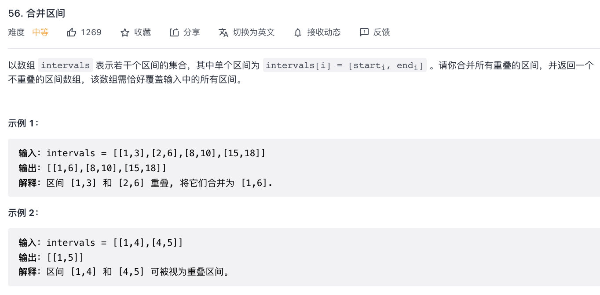
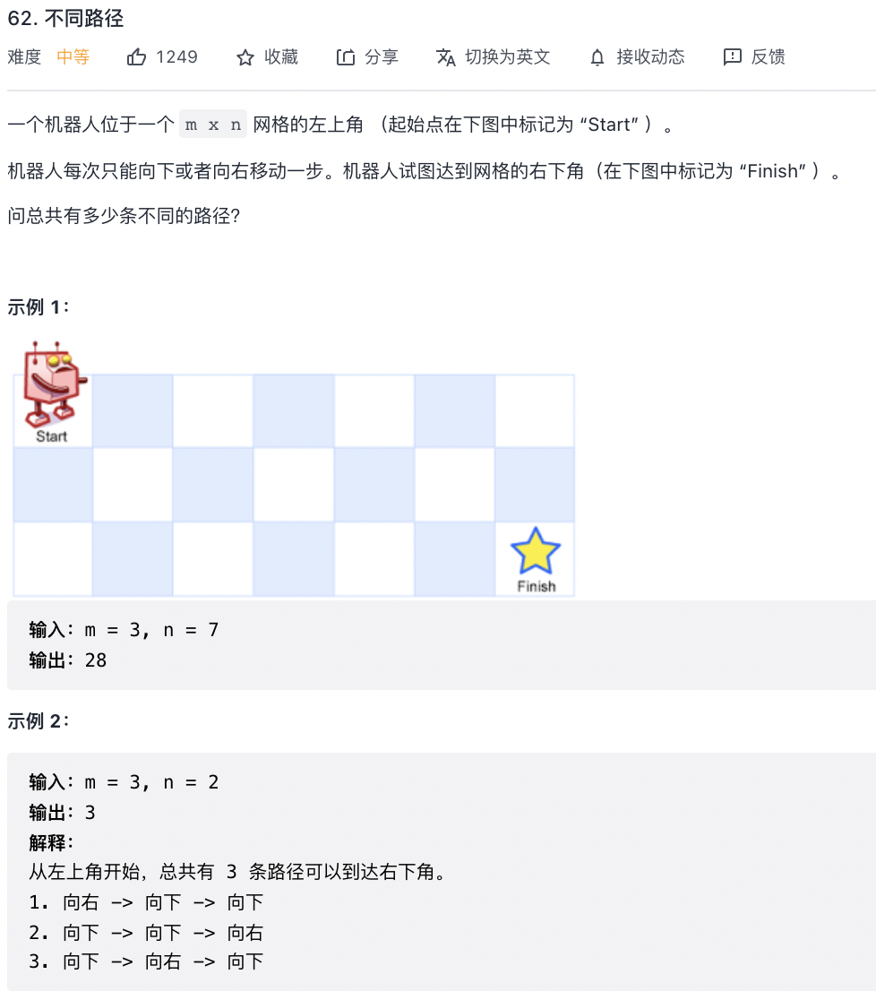

# leetcode（56）

## 56. 合并区间

```
/**
 * 56. 合并区间
 * @param {number[][]} intervals
 * @return {number[][]}
 */
const merge = (intervals) => {
    const len = intervals.length;
    const stack = [];
    // 排序
    intervals.sort((a, b) => a[0] - b[0]);
    for (let i = 0; i < len; i++) {
        // 如果栈顶区间和当前遍历的区间有交集，
        // 则将它们合并为一个新区间，替换之前栈顶的区间。
        if (stack.length > 0 && stack[stack.length - 1][1] >= intervals[i][0]) {
            const top = stack.pop();
            // 注意：这里的右边界要取两个区间的最大值，
            // 例如：[1, 4], [2, 3] 两个区间，合并之后变为：[1, 4] 而不是 [1, 3]。
            stack.push([top[0], Math.max(intervals[i][1], top[1])]);
        }
        // 否则直接将当前区间压入栈顶。
        else {
            stack.push(intervals[i]);
        }
    }
    return stack;
};
```


## 57. 插入区间

```
/**
 * 57. 插入区间
 * @param {number[][]} intervals
 * @param {number[]} newInterval
 * @return {number[][]}
 */
const insert = function (intervals, newInterval) {
    let res = [];
    intervals.push(newInterval);
    let len = intervals.length;
    if (len == 0) return [];
    intervals.sort((a, b) => a[0] - b[0]);
    let i = 0;
    while (i < len) {
        let currLeft = intervals[i][0];
        let currRight = intervals[i][1];
        while (i < len - 1 && intervals[i + 1][0] <= currRight) {
            i++;
            currRight = Math.max(intervals[i][1], currRight);
        }
        res.push([currLeft, currRight]);
        i++;
    }
    return res;
};
```


## 58. 最后一个单词的长度

```
/**
 * 58. 最后一个单词的长度
 * @param {string} s
 * @return {number}
 */
const lengthOfLastWord = (s) => {
    const arr = s.trim().split(' ');
    return arr[arr.length - 1].length
};
```

## 61. 旋转链表

```
/**
 * Definition for singly-linked list.
 * function ListNode(val, next) {
 *     this.val = (val===undefined ? 0 : val)
 *     this.next = (next===undefined ? null : next)
 * }
 */
/**
 * 61. 旋转链表
 * @param {ListNode} head
 * @param {number} k
 * @return {ListNode}
 */
const rotateRight = (head, k) => {
    if (k === 0 || !head || !head.next) {
        return head;
    }
    let n = 1;
    let cur = head;
    while (cur.next) {
        cur = cur.next;
        n++;
    }
    let add = n - k % n;
    if (add === n) {
        return head;
    }
    cur.next = head;
    while (add) {
        cur = cur.next;
        add--;
    }
    const ret = cur.next;
    cur.next = null;
    return ret;
};
```

## 62. 不同路径

```
/**
 * 62. 不同路径
 * @param {number} m
 * @param {number} n
 * @return {number}
 */
const uniquePaths = (m, n) => {
    let memo = new Array(m).fill(0).map(() => new Array(n).fill(0));
    // 定义：从 (0, 0) 到 (x, y) 有 dp(x, y) 条路径
    const dp = (x, y) => {
        if (x == 0 && y == 0) return 1;
        if (x < 0 || y < 0) return 0;
        if (memo[x][y] > 0) return memo[x][y];
        // 状态转移方程：到达 (x, y) 的路径数等于到达 (x - 1, y) 和 (x, y - 1) 路径数之和
        return (memo[x][y] = dp(x - 1, y) + dp(x, y - 1));
    };
    return dp(m - 1, n - 1);
};
```