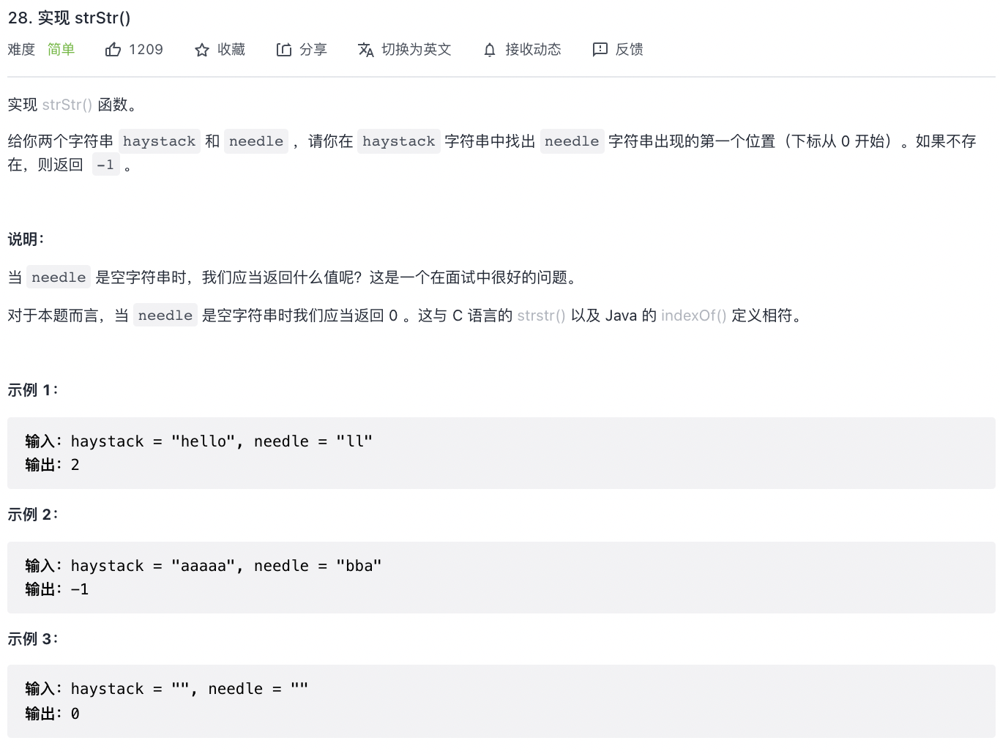
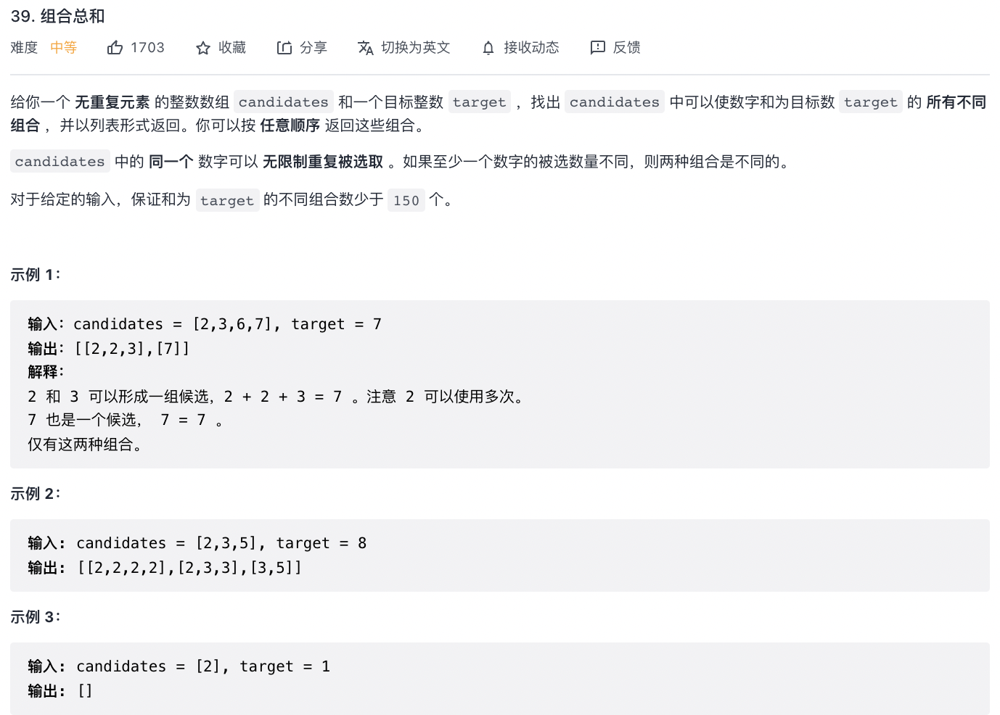
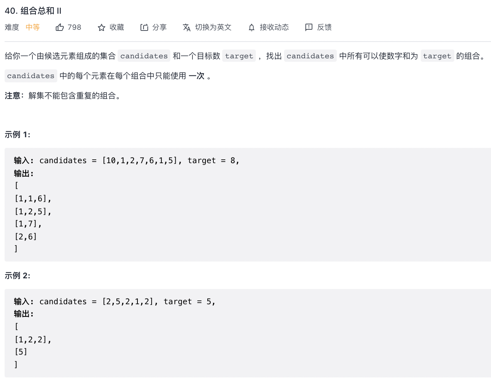
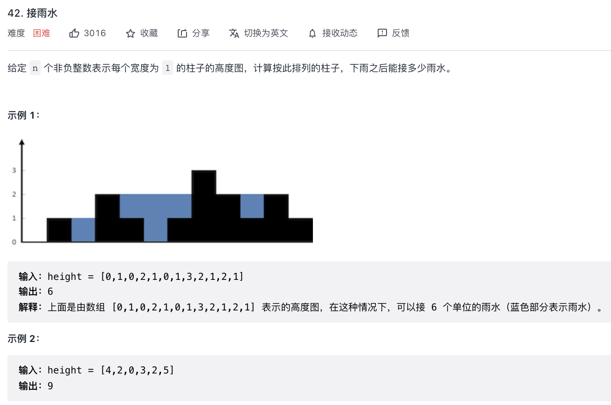
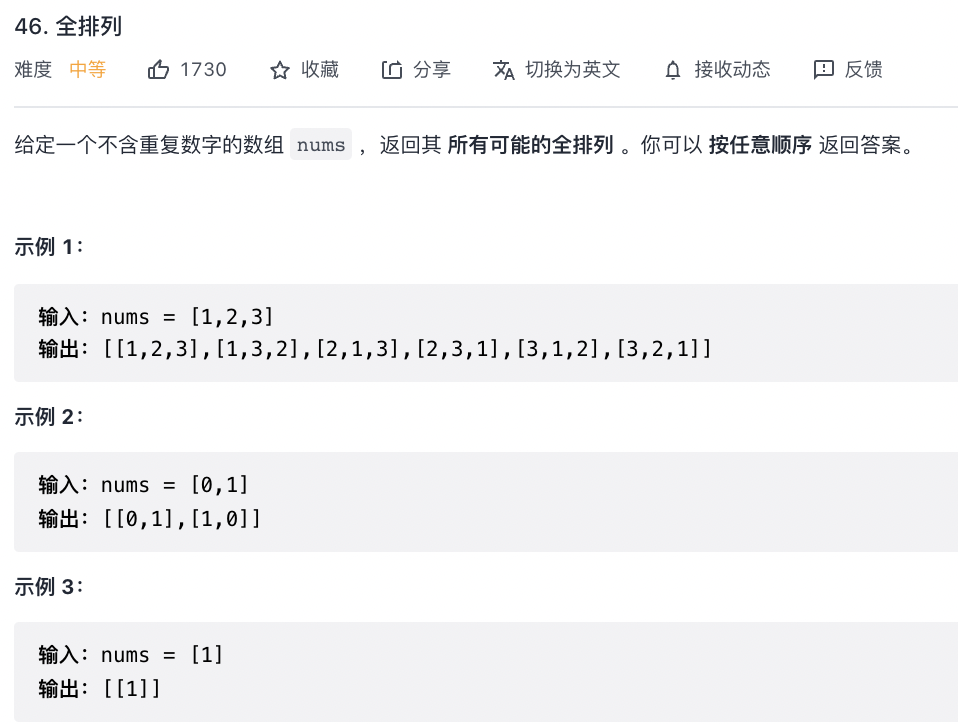
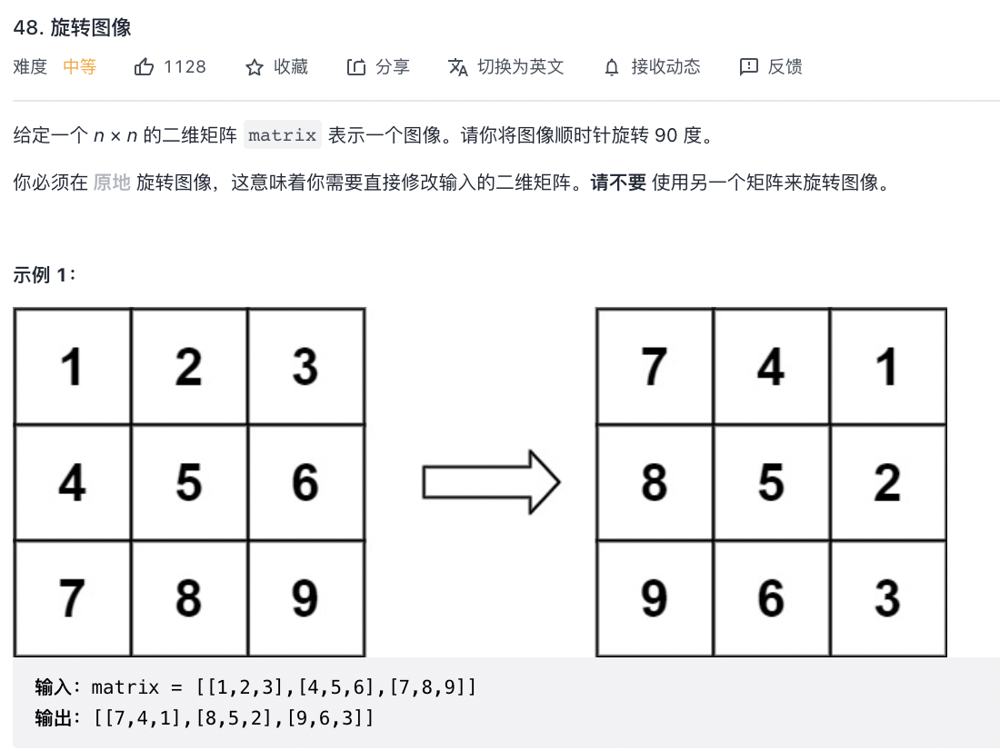
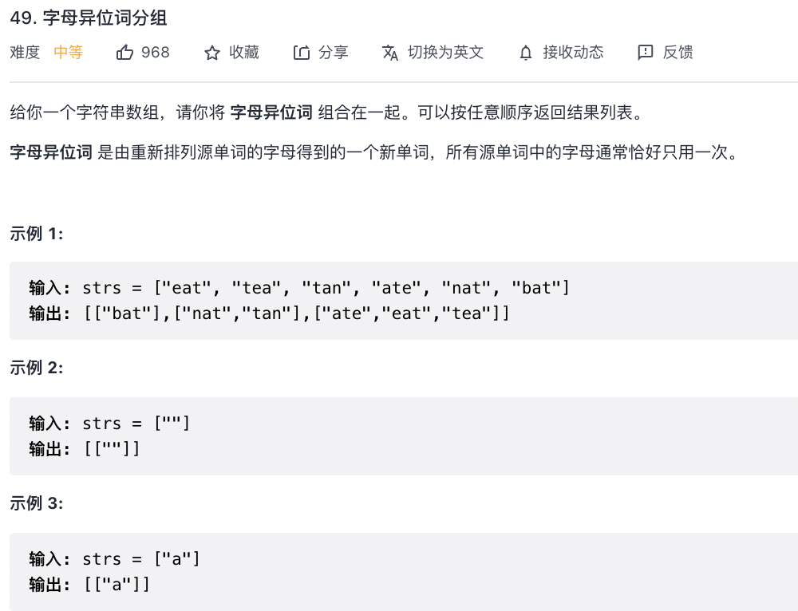
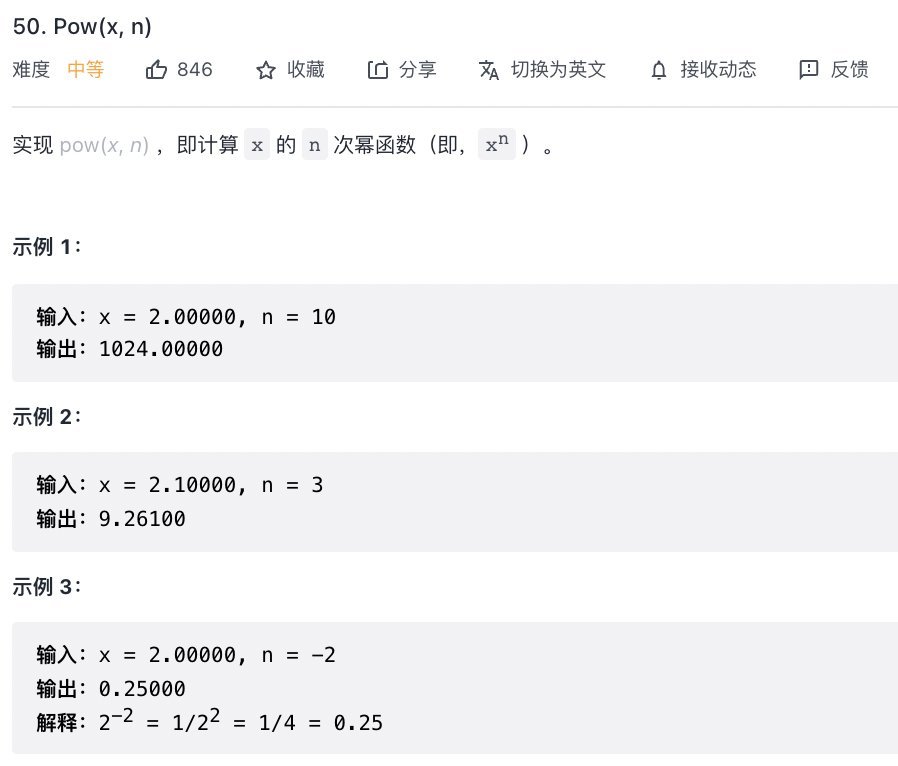
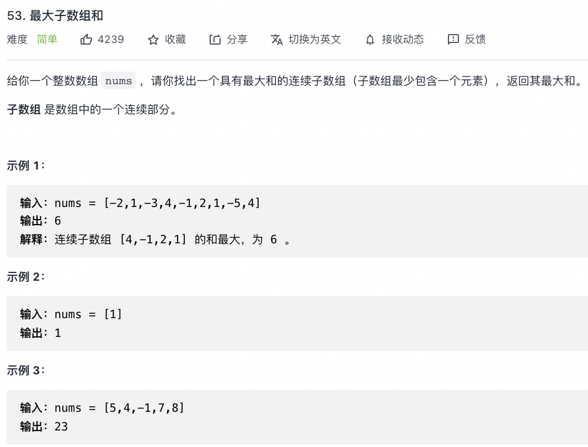
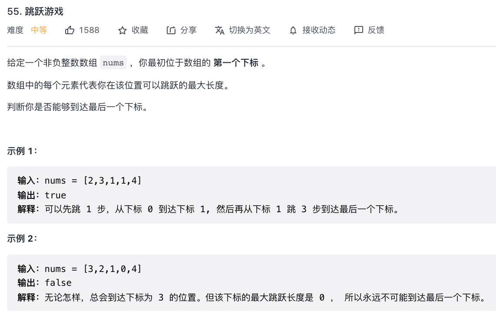

# leetcode（28-55）

## 28. 实现 strStr()

```
/**
 * 28. 实现 strStr()
 * @param {string} haystack
 * @param {string} needle
 * @return {number}
 */
const strStr = (haystack, needle) => {
    const n = haystack.length, m = needle.length;
    for (let i = 0; i + m <= n; i++) {
        let flag = true;
        for (let j = 0; j < m; j++) {
            if (haystack[i + j] != needle[j]) {
                flag = false;
                break;
            }
        }
        if (flag) {
            return i;
        }
    }
    return -1;
};
```

## 39. 组合总和

```
/**
 * 39. 组合总和
 * @param {number[]} candidates
 * @param {number} target
 * @return {number[][]}
 */
const combinationSum = (candidates, target) => {
    const ans = [];
    const dfs = (target, combine, idx) => {
        if (idx === candidates.length) {
            return;
        }
        if (target === 0) {
            ans.push(combine);
            return;
        }
        // 直接跳过
        dfs(target, combine, idx + 1);
        // 选择当前数
        if (target - candidates[idx] >= 0) {
            dfs(target - candidates[idx], [...combine, candidates[idx]], idx);
        }
    }
    dfs(target, [], 0);
    return ans;
};
```

## 40. 组合总和 II

```
/**
 * 40. 组合总和 II
 * @param {number[]} candidates
 * @param {number} target
 * @return {number[][]}
 */
const combinationSum2 = (candidates, target) => {
    candidates.sort((a, b) => a - b)
    let ans = [];
    let backTracing = (start, path, sum) => {
        if (sum >= target) {
            if (sum === target) {
                ans.push(path.slice())
            }
            return
        }
        for (let i = start; i < candidates.length; i++) {
            if (i - 1 >= start && candidates[i - 1] == candidates[i]) {
                continue;
            }
            path.push(candidates[i])
            backTracing(i + 1, path, sum + candidates[i])
            path.pop()
        }
    }
    backTracing(0, [], 0)
    return ans
};
```

## 42. 接雨水

```
/**
 * 42. 接雨水
 * @param {number[]} height
 * @return {number}
 */
 const trap = height => {
    let count = 0;
    let [left, right] = [0, height.length - 1];
    let [leftMax, rightMax] = [0, 0];
    while (left < right) {
        leftMax = Math.max(leftMax, height[left]);
        rightMax = Math.max(rightMax, height[right]);
        if (leftMax < rightMax) {
            count += leftMax - height[left++];
        } else {
            count += rightMax - height[right--];
        }
    }
    return count;
};
```

## 46. 全排列

```
/**
 * 46. 全排列
 * @param {number[]} nums
 * @return {number[][]}
 */
const permute = (nums) => {
    // 结果集
    let res = [];
    // 路径
    let path = [];
    // 路径：记录在path中
    // 选择列表：nums中不存在于pah的那些元素
    // 结束条件：nums中的元素全都path中出现
    let dfs = (nums, path) => {
        if (path.length == nums.length) {
            return res.push(path.concat());
        }
        for (let i = 0; i < nums.length; i++) {
            // 排除不合法的选择
            if (path.indexOf(nums[i]) > -1) {
                continue;
            }
            // 做选择
            path.push(nums[i]);
            // 进入下层决策树
            dfs(nums, path);
            // 取消选择
            path.pop();
        }
    };
    dfs(nums, path);
    return res;
};
```


## 48. 旋转图像

```
/**
 * 48. 旋转图像
 * @param {number[][]} matrix
 * @return {void} Do not return anything, modify matrix in-place instead.
 */
const rotate = (matrix) => {
    const n = matrix.length;
    const matrix_new = new Array(n).fill(0).map(() => new Array(n).fill(0));
    for (let i = 0; i < n; i++) {
        for (let j = 0; j < n; j++) {
            matrix_new[j][n - i - 1] = matrix[i][j];
        }
    }
    for (let i = 0; i < n; i++) {
        for (let j = 0; j < n; j++) {
            matrix[i][j] = matrix_new[i][j];
        }
    }
};
```

## 49. 字母异位词分组

```
/**
 * 49. 字母异位词分组
 * @param {string[]} strs
 * @return {string[][]}
 */
const groupAnagrams = (strs) => {
    const map = new Map();
    for (let str of strs) {
        let array = Array.from(str);
        array.sort();
        let key = array.toString();
        let list = map.get(key) ? map.get(key) : new Array();
        list.push(str);
        map.set(key, list);
    }
    return Array.from(map.values());
};
```


## 50. Pow(x, n)

```
/**
 * 50. Pow(x, n)
 * @param {number} x
 * @param {number} n
 * @return {number}
 */
const myPow = (x, n) => {
    // 递归出口
    if (n === 0) return 1;
    // n小于0，特殊情况
    if (n < 0) return 1 / myPow(x, -n);
    // n奇数
    if (n & 1) return x * myPow(x, n - 1);
    // n偶数
    return myPow(x * x, n / 2);
};
```


## 53. 最大子数组和

```
/**
 * 53. 最大子数组和
 * @param {number[]} nums
 * @return {number}
 */
const maxSubArray = (nums) => {
    let pre = 0, maxAns = nums[0];
    nums.forEach((x) => {
        pre = Math.max(pre + x, x);
        maxAns = Math.max(maxAns, pre);
    });
    return maxAns;
};
```


## 55. 跳跃游戏

```
/**
 * 55. 跳跃游戏
 * @param {number[]} nums
 * @return {boolean}
 */
const canJump = (nums) => {
    if (nums.length === 1) return true
    let cover = 0
    for (let i = 0; i <= cover; i++) {
        cover = Math.max(cover, i + nums[i])
        if (cover >= nums.length - 1) {
            return true
        }
    }
    return false
};
```